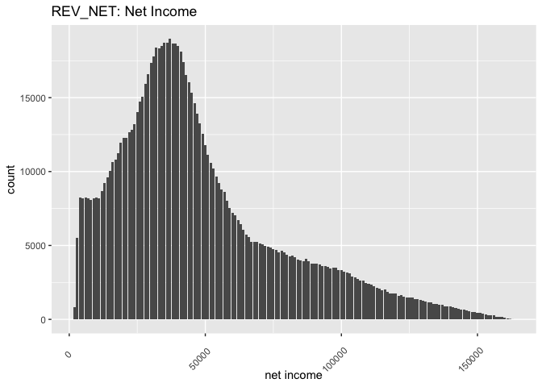

# Credit Risk Modelling
Leveraging machine learning techniques to maximize profits from loans by addressing class imbalance, employing a two-stage modeling approach, and optimizing model performance using F1 score for classification and RMSE for regression tasks.

## Problem Statement

In this project, my primary focus is on quantifying the credit risk associated with individuals applying for loans at a bank. The project encompasses two key objectives:

1. **Loan Approval:** I aim to make informed decisions regarding which applicants should be granted loans based on their unique characteristics. This aspect of the project constitutes a binary classification task, where each loan application is categorized as either "default" or "non-default."

2. **Loan Amount Determination:** For applicants identified as non-default in the classification phase, I proceed to predict the appropriate loan amount that should be extended to each individual. This task represents a regression problem, where the goal is to estimate the loan amount.

The overarching goal of these tasks is to maximize the bank's profits derived from these loans. By accurately classifying loan applications and optimizing the loan amounts, I strive to ensure that the bank makes well-informed lending decisions, ultimately leading to enhanced profitability.

## Data

In this project, I'm working with a substantial dataset comprising 1 million rows and 32 columns. It's essential to note that this dataset exhibits a significant **class imbalance**, with only 5% of the loan applications resulting in defaults, amounting to 50,000 cases. 

The dataset encompasses various features providing information about the customers, as well as details regarding their default status. Additionally, it includes data related to the magnitude of profit or loss incurred for each loan.

Effectively addressing the class imbalance and leveraging this rich dataset will be crucial in developing robust models for classifying loan applications and determining appropriate loan amounts to maximize the bank's profitability.

## Methodology

### Data Pre-Processing

As part of the data pre-processing phase, several crucial steps are undertaken:

    - Redundant Feature Elimination
    - Missing Value Imputation
    - Outlier Detection
    - Correlation and Multicollinearity Assessment among Variables
    - Class Imbalance Handling through Undersampling with SMOTE

These pre-processing steps collectively contribute to the preparation of our dataset for effective modeling and analysis.

### Model Design

I've developed a two-stage framework for this task, designed to maximize the bank's profitability:

1. **Binary Classification Model:** In the first stage, I've constructed a binary classification model to estimate the probability of default for each individual. If the estimated probability exceeds a predetermined cutoff value, the loan amount assigned will be greater than zero. Otherwise, the loan amount is set to zero.

2. **Regression Model:** The second stage involves a regression model that predicts the loan amount for individuals predicted to be non-defaulters by the classification model. If the predicted loan amount is less than the requested loan amount, the assigned loan amount matches the prediction. However, if the predicted amount exceeds the requested loan amount, the loan amount provided aligns with the applicant's request.

This method offers the advantage of being intuitive and easily interpretable, providing a straightforward framework for decision-making in loan approval and amount determination.

## Models

### Classification
I have employed the following three models for this task, each with its unique strengths:

1. **Logistic Regression (Baseline):** Logistic regression serves as the baseline model due to its simplicity and relatively quick build time. It offers a solid foundation for comparison with more complex models.

2. **XGBoost:** XGBoost is a renowned and highly effective machine learning algorithm known for its ability to yield exceptionally accurate results. Its inclusion enhances the model's predictive power.

3. **Adaboost:** Adaboost is a particularly suitable classification method for imbalanced datasets. Its utilization helps address the challenges posed by class imbalance.

For model evaluation, I've chosen the F1 score, a robust metric well-suited for imbalanced datasets. Additionally, within the logistic regression model, I've implemented variable selection using Lasso (L-1) regularization, which aids in optimizing the model's feature set.

### Regression
For the regression task, I've employed two powerful models:

1. **XGBoost:** XGBoost is a highly versatile and effective algorithm for regression tasks. It's known for its capability to provide accurate predictions and handle complex data patterns.

2. **Blackboost:** Blackboost is a gradient boosting method that utilizes regression trees as base-learners. This method is well-suited for regression tasks, offering robust predictive capabilities.

As the evaluation metric for regression, I've chosen the Mean Squared Error (MSE). This metric helps gauge the accuracy of our regression models by measuring the average squared difference between predicted and actual values.

## Results

### Identifying Important Features: Variable Importance

The variable importance analysis reveals some of the most influential variables in our models:

- Total used amount of revolving credit (MNT_UTIL_REN)
- Value of financial assets (MNT_ACT)
- Number of transactions refused due to insufficient funds in the last 12 months (NB_ER_12MS)

These results align with our expectations and provide valuable insights. Clients with low financial liabilities or high credit utilization tend to exhibit a higher risk of default. Additionally, the number of transactions refused due to insufficient funds in the last 12 months serves as a reliable indicator of whether a client can repay their debt through their savings or assets.

These findings underscore the significance of these variables in our models and their critical role in assessing and mitigating default risk effectively.

### Model Performances

In the **classification** task, Adaboost achieved a remarkable F1 score of 96.3%, while logistic regression obtained an F1 score of 90%. This represents a substantial 6% improvement by Adaboost over the baseline model.

For the **regression** task, both XGBoost and Blackboost demonstrated impressive performance, yielding an RMSE value of 10,100. These models consistently deliver accurate predictions, ensuring the precision of loan amount estimates.
