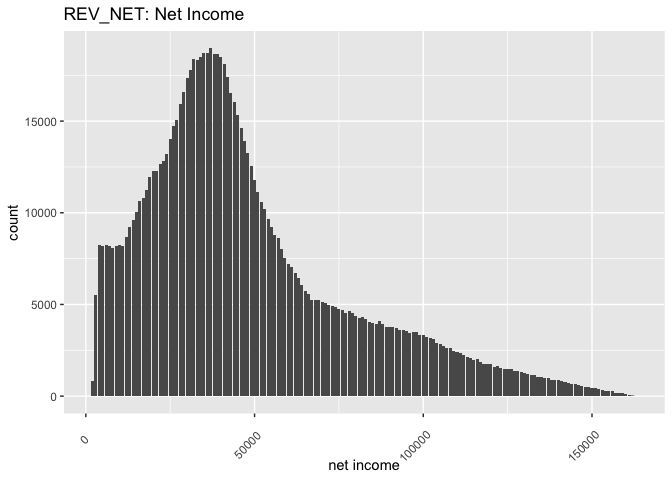

Credit Risk Modelling using R
================

To optimize profitability while minimizing potential losses in the lending process, banks place great importance on the thorough evaluation of their borrowers. This emphasis on meticulous borrower assessment has given rise to the widespread utilization of statistical analysis and data science for the computation of credit risk.

Within the confines of this notebook, I delve into a dataset encompassing loan applications, with the objective of constructing a predictive model. This model aims to facilitate loan approval decisions and determine the loan amounts, all while striving to enhance the overall financial returns for the bank. The dataset at our disposal comprises information pertaining to the disbursement of funds to a diverse group of customers. This extensive dataset encompasses a total of 1,000,000 clients, of whom 50,000 (representing 5%) have experienced loan defaults. It's important to note that the dataset is characterized by an inherent imbalance.

My journey commences with an exploration of the data, during which I glean valuable insights, address missing data issues, and employ visualization techniques to better understand key features. Subsequently, I embark on the development of a sophisticated two-stage framework for predictive purposes. In the initial phase, I construct a binary classification model designed to estimate the probability of default for each individual. Following this, I proceed to create a regression model, fine-tuned to predict loan amounts for individuals identified as non-defaulters. This comprehensive approach is orchestrated with the ultimate goal of ensuring prudent lending practices while optimizing the bank's financial gains.

``` r
library(caret)
library(MASS)
library(corrplot)
library(DMwR)
library(ROCR)
library(glmnet)
library(caTools)
library(dplyr)
library(cvms)
library(e1071)
library(MLmetrics)
library(RColorBrewer)
library(ggplot2)
library(adabag)
library(xgboost)
library(mboost)
library(viridis)
library(hrbrthemes)
require(scales)
```

``` r
source("functions.R")
```

``` r
set.seed(234) 
creditData<-read.csv("CreditGame.csv")
```

## 1. Exploratory Data Analysis (EDA)

Our initial step entails a thorough examination of the dataset. Here, our primary focus is to discern the types of variables within the dataset, scrutinize its inherent features, and pinpoint any variables with missing values.

``` r
str(creditData)
```

    ## 'data.frame':    1000000 obs. of  31 variables:
    ##  $ ID_TRAIN    : int  5000000 5000001 5000002 5000003 5000004 5000005 5000006 5000007 5873590 5000009 ...
    ##  $ NB_EMPT     : int  1 1 1 1 2 1 1 1 1 1 ...
    ##  $ R_ATD       : num  0.14 0.48 0.49 0.33 0.16 0.02 0.36 0.23 0.15 0.33 ...
    ##  $ DUREE       : int  5 3 7 3 5 2 4 2 3 2 ...
    ##  $ PRT_VAL     : num  0.93 1 1 0.95 0.98 1 1 1 0.45 0.67 ...
    ##  $ AGE_D       : int  68 57 19 58 42 29 32 47 27 46 ...
    ##  $ REV_BT      : int  125000 49000 57000 173000 66000 43000 124000 148000 42000 52000 ...
    ##  $ REV_NET     : int  88000 36000 39000 113000 51000 24000 87000 116000 37000 36000 ...
    ##  $ TYP_RES     : chr  "L" "A" "P" "P" ...
    ##  $ ST_EMPL     : chr  "R" "T" "R" "R" ...
    ##  $ MNT_EPAR    : int  210676 2026 430 121453 5665 2245 186645 85085 53816 4850 ...
    ##  $ NB_ER_6MS   : int  0 4 0 2 3 0 0 0 0 0 ...
    ##  $ NB_ER_12MS  : int  0 7 0 2 4 0 0 0 0 0 ...
    ##  $ NB_DEC_12MS : int  0 0 0 0 0 0 0 0 0 0 ...
    ##  $ NB_OPER     : int  8 5 9 5 3 13 6 6 9 6 ...
    ##  $ NB_COUR     : int  6 4 9 2 1 5 6 0 4 4 ...
    ##  $ NB_INTR_1M  : int  0 0 0 0 0 0 1 0 0 0 ...
    ##  $ NB_INTR_12M : int  0 0 0 0 0 0 1 0 0 0 ...
    ##  $ PIR_DEL     : int  0 0 0 0 0 0 0 0 0 0 ...
    ##  $ NB_DEL_30   : int  0 0 0 0 0 0 0 0 0 0 ...
    ##  $ NB_DEL_60   : int  0 0 0 0 0 0 0 0 0 0 ...
    ##  $ NB_DEL_90   : int  0 0 0 0 0 0 0 0 0 0 ...
    ##  $ MNT_PASS    : int  148818 0 2805 52870 441824 8151 16622 931 438399 11063 ...
    ##  $ MNT_ACT     : int  210676 323502 430 121453 748303 2245 319459 85085 452514 4850 ...
    ##  $ MNT_AUT_REN : int  500 4000 21500 4500 8500 3500 2000 0 1500 1000 ...
    ##  $ MNT_UTIL_REN: int  440 0 9022 476 3613 248 1999 0 1500 281 ...
    ##  $ NB_SATI     : int  4 4 9 4 3 10 1 5 6 6 ...
    ##  $ TYP_FIN     : chr  "AUTO" "AUTO" "AUTO" "AUTO" ...
    ##  $ MNT_DEMANDE : int  31500 16800 22200 6000 19600 30200 25100 38500 33800 31300 ...
    ##  $ DEFAULT     : int  0 0 0 0 0 0 0 0 1 0 ...
    ##  $ PROFIT_LOSS : num  1575 840 1110 300 980 ...

- The dataset comprises 1,000,000 observations and encompasses 31 variables of which 3 are numerical, 3 are categorical and 25 are integer.

``` r
prop.table(table(creditData$DEFAULT))
```

    ## 
    ##    0    1 
    ## 0.95 0.05

- Within our dataset, a notable imbalance exists, with a substantial 95% of applicants demonstrating a non-defaulting status, while a relatively small 5% fall into the category of defaulters. This inherent class imbalance presents a significant consideration in our analysis.

``` r
# net income
rev <- ggplot(creditData, aes(REV_NET))
rev <- rev + geom_histogram(stat="count") + labs(title = "REV_NET: Net Income", x = "net income")+
  theme(axis.text.x=element_text(angle=45,hjust=0.8,vjust=0.5))
rev
```

<!-- -->

- The histogram representing net income exhibits a distinct right-skew, with an approximate mean value hovering at $48,000 and a median value of approximately $41,000.

``` r
# age of the borrower
age <- ggplot(creditData, aes(AGE_D))
age <- age + geom_histogram(stat="count") + labs(title = "AGE_D: Age of the borrower")+
  theme(axis.text.x=element_text(angle=90,hjust=1,vjust=0.5))
age
```

<!-- -->

- Similarly, the age distribution is right-skewed, characterized by a mean age of 38 years.

``` r
# employment status
empl <- ggplot(creditData, aes(ST_EMPL))
empl <- empl + geom_bar(aes(y = (..count..)/sum(..count..))) + labs(title = "ST_EMPL: Employment Status", y = "Percent", x = "Employment Status") +
  scale_y_continuous(labels=percent) + 
  theme(axis.text.x=element_text(angle=90,hjust=1,vjust=0.5))
empl
```

<!-- -->

- The majority of applicants do not hold full-time employment positions, while approximately 32% of applicants are classified as part-time employees.

``` r
# residence type
res <- ggplot(creditData, aes(TYP_RES))
res <- res + geom_bar(aes(y = (..count..)/sum(..count..))) + labs(title = "TYP_RES: Residence Type", y = "Percent", x = "Residence Type") +
  scale_y_continuous(labels=percent) + 
  theme(axis.text.x=element_text(angle=90,hjust=1,vjust=0.5))
res
```

<!-- -->

- A striking 85% of the total loan portfolio is allocated to individual borrowers, with the remaining 15% of loans extended to joint applicants consisting of two individuals.

``` r
# savings value
EPAR <- ggplot(creditData, aes(MNT_EPAR))
EPAR <- EPAR + geom_histogram(stat="count") + labs(title = "MNT_EPAR: Savings Value")+
  theme(axis.text.x=element_text(angle=90,hjust=1,vjust=0.5))
EPAR
```

<!-- -->

- The distribution of savings values also exhibits a pronounced right-skew, with the majority of applicants either having minimal savings or none at all.

``` r
# default by age
creditData %>% count(AGE_D, DEFAULT) %>%
  ggplot() +  labs(title = "Default by Age", y = "Percent") +
  geom_col(aes(x= AGE_D, y = n, fill= DEFAULT), position = 'fill')
```

<!-- -->

- The plot suggests that a higher default rate is observed among younger individuals, which aligns with expectations, as young adults typically experience greater financial instability compared to their older counterparts. While the observed difference appears noteworthy, it is imperative to conduct further in-depth statistical analysis to solidify this observation and establish its significance.

``` r
# default by employment
creditData %>% count(ST_EMPL, DEFAULT) %>%
  ggplot() + labs(title = "Default by Employment", y = "Percent") +
  geom_col(aes(x= ST_EMPL, y = n, fill= DEFAULT), position = 'fill')
```

<!-- -->

- It's discernible that applicants with regular or full-time employment (R) exhibit a lower default rate, in line with expectations. On the other hand, self-employed individuals (T) and those in the unlabeled category with an empty string ("") tend to default more frequently. However, at this stage, the observed differences do not appear to be statistically significant. Further analysis will be necessary to confirm the significance of these trends.

## 2. Pre-processing

### Addressing missing data

``` r
colSums(is.na(creditData))
```

    ##     ID_TRAIN      NB_EMPT        R_ATD        DUREE      PRT_VAL        AGE_D 
    ##            0            0            0            0            0        19989 
    ##       REV_BT      REV_NET      TYP_RES      ST_EMPL     MNT_EPAR    NB_ER_6MS 
    ##            0            0            0            0            0            0 
    ##   NB_ER_12MS  NB_DEC_12MS      NB_OPER      NB_COUR   NB_INTR_1M  NB_INTR_12M 
    ##            0            0            0            0            0            0 
    ##      PIR_DEL    NB_DEL_30    NB_DEL_60    NB_DEL_90     MNT_PASS      MNT_ACT 
    ##            0            0            0            0            0            0 
    ##  MNT_AUT_REN MNT_UTIL_REN      NB_SATI      TYP_FIN  MNT_DEMANDE      DEFAULT 
    ##            0            0            0            0            0            0 
    ##  PROFIT_LOSS 
    ##            0

``` r
unique(creditData$TYP_FIN)
```

    ## [1] "AUTO"

``` r
unique(creditData$TYP_RES)
```

    ## [1] "L" "A" "P"

``` r
unique(creditData$ST_EMPL)
```

    ## [1] "R" "T" ""  "P"

- We have identified missing values in the "Age_D" variable.

- The ST_EMPL variable contains empty string cells ("") that could either represent missing values or possibly convey specific information. It's important to clarify whether a NaN value merely signifies the absence of the feature (e.g., no employment) or if it might denote an alternative category like "Other." To resolve this, further data exploration and domain knowledge are essential.

- I will convert both the TYP_RES and ST_EMPL variables into factorized representations. TYP_RES will have three distinct categories, while ST_EMPL will be factorized with four categories.

- The variable TYP_FIN, with only a single category (AUTO), does not contribute any meaningful information to our analysis. Therefore, it is prudent to remove this variable from our dataset.

### Missing Values for AGE_D

``` r
creditData$Age_binary <- ifelse(is.na(creditData$AGE_D), 1, 0)
mod_binary <- glm(DEFAULT~Age_binary, data = creditData, family = "binomial")
summary(mod_binary)
```

    ## 
    ## Call:
    ## glm(formula = DEFAULT ~ Age_binary, family = "binomial", data = creditData)
    ## 
    ## Deviance Residuals: 
    ##     Min       1Q   Median       3Q      Max  
    ## -0.3203  -0.3203  -0.3203  -0.3203   2.4529  
    ## 
    ## Coefficients:
    ##              Estimate Std. Error  z value Pr(>|z|)    
    ## (Intercept) -2.944172   0.004634 -635.331   <2e-16 ***
    ## Age_binary  -0.013458   0.032972   -0.408    0.683    
    ## ---
    ## Signif. codes:  0 '***' 0.001 '**' 0.01 '*' 0.05 '.' 0.1 ' ' 1
    ## 
    ## (Dispersion parameter for binomial family taken to be 1)
    ## 
    ##     Null deviance: 397030  on 999999  degrees of freedom
    ## Residual deviance: 397030  on 999998  degrees of freedom
    ## AIC: 397034
    ## 
    ## Number of Fisher Scoring iterations: 5

In the initial step, I assess whether the missing data in the AGE_D variable have a significant impact on explaining the response variable, DEFAULT. To accomplish this, I create a binary variable named AGE_binary, which assumes the value 1 if AGE_D is empty and 0 otherwise.

I subsequently fit a logistic regression model, where DEFAULT serves as the response variable, and AGE_binary functions as the explanatory variable. The obtained p-value of 0.683, when considered against a reasonable significance level ($\alpha = 0.05), leads me to reject the null hypothesis. Consequently, I conclude that the AGE_binary variable lacks significance in explaining DEFAULT.

This analysis leads me to conclude that the missing data in AGE_D are not "MNAR" (Missing Not At Random). They likely fall into the categories of "MCAR" (Missing Completely At Random) or "MAR" (Missing At Random), indicating that it is safe to implement simple or multiple imputation techniques. Consequently, I proceed to remove the AGE_binary variable from the dataset.

``` r
creditData$Age_binary <- NULL
correlations <- cor(Filter(is.numeric, creditData), use = "complete.obs")
corrplot(correlations, type="lower", method="number", order="hclust", number.cex=0.30, 
         tl.srt=45, tl.cex=0.50, col=brewer.pal(n=5, name="Spectral"))
```

<!-- -->

``` r
creditData$AGE_D[is.na(creditData$AGE_D)] <- median(creditData$AGE_D,  na.rm = TRUE)
```

After constructing a correlation matrix, it becomes evident that there is no significant correlation between AGE_D and any other explanatory variable. Consequently, there is no need to preserve the correlation structure among these variables. This indicates that a straightforward imputation approach, such as using the median value, is sufficient.

As a result, I proceed to impute the missing values in the AGE_D variable with its median value. This robust alternative to mean imputation ensures that the AGE_D variable is now free of any missing data.

### Missing Values for ST_EMPL

``` r
creditData[creditData==""]<-NA
creditData$ST_EMPL[is.na(creditData$ST_EMPL)] <- "O"
sum(is.na(creditData$ST_EMPL))
```

    ## [1] 0

Within the ST_EMPL variable, we observe that 10% of the cells contain empty strings, and simply removing them would introduce significant bias into the analysis. We are presented with two viable options for addressing this issue:

  1. Impute the missing values with the mode (most frequent category) among observations.
  2. Assume that the missing values represent another meaningful category, such as "Other," which was not explicitly indicated in the existing categories. This new category could be labeled as "O."

Informed by domain knowledge and a reasonable hypothesis, I opt for the second approach. I posit that the missing values in ST_EMPL belong to the "Other" category, labeled as "O." As a result of this imputation, the ST_EMPL variable is now devoid of any missing values.

### Eliminating Redundant Features

``` r
creditData$TYP_FIN <- NULL
creditData$PROFIT_LOSS <- NULL
creditData$ID_TRAIN <- NULL
creditData$NB_INTR_12M <- NULL
```

In streamlining our dataset and enhancing the model's efficiency, I undertake the following actions:

  1. TYP_FIN, which contains only a single category (AUTO), does not contribute any meaningful information to the model. Consequently, I proceed to remove it.

  2. The variable PROFIT_LOSS is invariably 5% of DEFAULT, indicating a linear dependence between the two. In light of this, I opt to remove PROFIT_LOSS from the dataset.

  3. The variable ID_TRAIN, representing Unique borrower IDs, may either contain chance information or offer no valuable insights for the model. To simplify our dataset, I choose to remove it.

  4. Within the correlation matrix, it is evident that variables NB_INTR_1M and NB_INTR_12M exhibit a perfect correlation of 1. This implies that one variable fully explains the other. To avoid redundancy, I eliminate the variable NB_INTR_12M from our dataset.

These measures are implemented to streamline our dataset and enhance the modeling process.

### Converting Categorical Variables into Factors

``` r
levels <- unique(creditData$DEFAULT) 
creditData$DEFAULT=factor(creditData$DEFAULT, labels=make.names(levels))
creditData$ST_EMPL <- as.factor(creditData$ST_EMPL)
creditData$TYP_RES <- as.factor(creditData$TYP_RES)
```

### Train-test-validation Split

``` r
# train-test-valid split
spec = c(train = .5, test = .25, validation = .25)

g = sample(cut(
  seq(nrow(creditData)), 
  nrow(creditData)*cumsum(c(0,spec)),
  labels = names(spec)
))

res = split(creditData, g)
sapply(res, nrow)/nrow(creditData)
```

    ##      train       test validation 
    ##       0.50       0.25       0.25

``` r
addmargins(prop.table(table(g)))
```

    ## g
    ##      train       test validation        Sum 
    ##       0.50       0.25       0.25       1.00

``` r
creditDataTrain = res$train
creditDataTest = res$test
creditDataValid = res$validation
```

I divide the dataset into three distinct subsets – the training set, the validation set, and the test set. Each subset comprises a specific portion of the data:

  1. The training set consists of 50% of the data and serves as the foundation for model training.
  2. The validation set encompasses 25% of the data. It plays a crucial role in selecting the best-performing model among several candidates and is also utilized in the watchlist object of some models.
  3. The test set is comprised of the remaining 25% of the data. Its primary purpose is to evaluate the generalization error of the trained models.

This partitioning strategy ensures that our models are effectively trained, validated, and rigorously tested, leading to reliable model performance assessments.

### Undersampling with SMOTE

``` r
creditDataTrain_smote <- SMOTE(DEFAULT~., data = creditDataTrain, perc.over=500, perc.under = 200)
prop.table(table(creditDataTrain_smote$DEFAULT))
```

    ## 
    ##    X0    X1 
    ## 0.625 0.375

To address the imbalanced nature of our dataset and enhance the predictive power of our models, two crucial techniques have been implemented:

1. **SMOTE (Synthetic Minority Over-sampling Technique):** The SMOTE algorithm, integrated via the DMwR library, rebalances the dataset by increasing the number of minority class samples by 200% and decreasing the number of majority class observations by 500%. Consequently, the final training dataset comprises 62.5% of the majority class and 37.5% of the minority class. This rebalancing strategy prioritizes the model's focus on learning the minority class, thereby improving its ability to identify defaulters effectively.

2. **Adjusting Model Weights:** Sample weights have been introduced during model training, assigning higher weights to the minority class and lower weights to the majority class. This strategic weighting ensures that the model allocates greater importance to the minority class when making predictions. By finely tuning these weights, the model's proficiency in accurately predicting the minority class is significantly enhanced.

The synergistic application of these two techniques provides a robust solution to counteract the challenges posed by class imbalance, leading to more precise and equitable model predictions.

## Modeling

I implement a two-stage approach, commencing with classification and followed by regression:

1. **Classification Phase:**
   - I calculate the default probability for each client based on their unique characteristics.
   - The loan approval decision hinges on the following rule: If the probability surpasses a specified cutoff value, the loan amount will be greater than zero; otherwise, it will be zero.

2. **Regression Phase:**
   - For clients predicted as non-defaulters in the initial stage, I employ regression models to predict the loan amount.
   - In cases where the predicted loan amount falls below the requested loan amount, I provide the predicted amount.
   - If the predicted loan amount exceeds the requested amount, I grant the requested loan amount.
   - The decision rule for determining the final loan amount is as follows:

$$
AmountLoaned= 
\begin{cases}
AmountPredicted &\text{ if } AmountPredicted < AmountRequested \\
AmountRequested &\text{ if }AmountPredicted > AmountRequested 
\end{cases}
$$

This approach offers the advantage of being intuitive and easily interpretable.

For the classification task, I've opted for three distinct models: logistic regression, XGBoost, and Adaboost. Here's the rationale behind each choice:

1. **Logistic Regression:** This serves as the baseline model due to its simplicity and swift construction. Logistic regression, coupled with Lasso regularization, helps in variable selection, ensuring that we include the most relevant features in our model.

2. **XGBoost:** Recognized as one of the foremost machine learning algorithms, XGBoost is renowned for its exceptional accuracy. It is a robust choice for classification tasks, contributing to high-quality results.

3. **Adaboost:** This method is particularly effective in classification tasks involving imbalanced data. Adaboost's ability to adapt to data imbalances makes it a valuable addition to our ensemble of models.

In the regression task, I've employed XGBoost and Blackboost:

1. **XGBoost:** As previously mentioned, XGBoost is a widely acclaimed ML algorithm known for its accuracy. It's a fitting choice for regression tasks where precise predictions are crucial.

2. **Blackboost:** Blackboost employs gradient boosting with regression trees as base-learners. This combination of techniques can yield robust results in regression tasks, enhancing our predictive capabilities.

By combining these diverse algorithms, we aim to leverage their individual strengths to achieve superior classification and regression performance while addressing the challenges posed by imbalanced data.

### Classification

#### Performance Metrics

Given the imbalanced dataset, "accuracy" as a metric in classification can be misleading. Thus, I've chosen the F-1 score, suitable for imbalanced data. Minimizing false negatives, where non-defaulters are misclassified, is crucial for the bank, alongside monitoring false positives.

#### Logistic Regression

##### Data Prep

``` r
credit_train_X <- dfToMatrixX(creditDataTrain_smote)
credit_test_X <- dfToMatrixX(creditDataTest)

credit_train_Y <- dfToY(creditDataTrain_smote)
credit_test_Y <- dfToY(creditDataTest)
```

##### Training

``` r
credit_lasso <- glmnet(x=credit_train_X, y=credit_train_Y, family = "binomial")
```

##### Variable Selection

In this context, my objective is to identify the optimal set of variables for achieving the most accurate predictions. To accomplish this, I employ Lasso regression.

``` r
credit_lasso_cv<- cv.glmnet(x=credit_train_X, y=credit_train_Y, family = "binomial", type.measure = "class")
plot(credit_lasso_cv)
```

``` r
coef(credit_lasso, s=credit_lasso_cv$lambda.1se)
```

    ## 30 x 1 sparse Matrix of class "dgCMatrix"
    ##                         s1
    ## (Intercept)  -1.549731e+00
    ## NB_EMPT      -1.158470e-01
    ## R_ATD        -1.554476e+00
    ## DUREE         1.897473e-01
    ## PRT_VAL       2.523281e+00
    ## AGE_D        -1.652102e-02
    ## REV_BT       -4.586218e-06
    ## REV_NET      -6.789860e-07
    ## TYP_RESL     -5.103484e-01
    ## TYP_RESP     -5.987834e-01
    ## ST_EMPLP     -8.577060e-02
    ## ST_EMPLR     -2.844994e-01
    ## ST_EMPLT      3.778981e-02
    ## MNT_EPAR      2.078842e-06
    ## NB_ER_6MS     7.260999e-02
    ## NB_ER_12MS    1.717143e-01
    ## NB_DEC_12MS   9.704198e-02
    ## NB_OPER       .           
    ## NB_COUR       .           
    ## NB_INTR_1M    1.983563e-02
    ## PIR_DEL       5.877923e-01
    ## NB_DEL_30     7.166133e-02
    ## NB_DEL_60     1.739399e-01
    ## NB_DEL_90     3.509019e-01
    ## MNT_PASS      1.222664e-06
    ## MNT_ACT      -2.857718e-06
    ## MNT_AUT_REN  -2.674624e-05
    ## MNT_UTIL_REN  3.961890e-05
    ## NB_SATI      -3.679513e-02
    ## MNT_DEMANDE   .

Following the cross-validation procedure, it has identified 29 out of the 30 variables as statistically significant. Consequently, I proceed with the 29 variables that were selected through this process for further analysis.

##### Prediction

``` r
pred_lasso_test <- predict(credit_lasso, newx=credit_test_X, s=credit_lasso_cv$lambda.1se, type = "response")

fn_rate_lasso <- fnRate(pred_lasso_test, creditDataTest, 0.5)
print(paste0("Lasso fn rate: ", round(fn_rate_lasso,2)))
```

    ## [1] "Lasso fn rate: 0.53"

``` r
f1_lasso <- f1Score(pred_lasso_test,creditDataTest,0.5)
print(paste0("Lasso f1 score: ", round(f1_lasso,2)))
```

    ## [1] "Lasso f1 score: 0.91"

``` r
optcut_lasso <- rocCurve(pred_lasso_test, credit_test_Y)
```

``` r
print(paste0("Lasso optimal fn rate: ", round(1-optcut_lasso[1],2)))
```

    ## [1] "Lasso optimal fn rate: 0.29"

#### XGBoost

##### Data Prep

``` r
dtrain <- dfToDMatrix(creditDataTrain_smote)
dtest <- dfToDMatrix(creditDataTest)
dvalid <- dfToDMatrix(creditDataValid)
```

##### Training

``` r
watchlist = list(train=dtrain, test=dvalid)
negative_cases <- sum(factorToNumeric(creditDataTrain_smote$DEFAULT) == FALSE)
postive_cases <- sum(factorToNumeric(creditDataTrain_smote$DEFAULT) == TRUE)

modelXgboostTuned <- xgb.train(data = dtrain, 
                        nround = 50, 
                        early_stopping_rounds = 3,
                        objective = "binary:logistic",
                        scale_pos_weight = negative_cases/postive_cases,
                        max.depth = 3,
                        gamma = 1,
                        watchlist=watchlist)
```

    ## [1]  train-logloss:0.639884  test-logloss:0.641350 
    ## Multiple eval metrics are present. Will use test_logloss for early stopping.
    ## Will train until test_logloss hasn't improved in 3 rounds.
    ## 
    ## [2]  train-logloss:0.607577  test-logloss:0.610023 
    ## [3]  train-logloss:0.581579  test-logloss:0.586139 
    ## [4]  train-logloss:0.563736  test-logloss:0.569378 
    ## [5]  train-logloss:0.549376  test-logloss:0.555872 
    ## [6]  train-logloss:0.535741  test-logloss:0.543427 
    ## [7]  train-logloss:0.520038  test-logloss:0.527838 
    ## [8]  train-logloss:0.501806  test-logloss:0.512325 
    ## [9]  train-logloss:0.490386  test-logloss:0.501303 
    ## [10] train-logloss:0.482953  test-logloss:0.493795 
    ## [11] train-logloss:0.475004  test-logloss:0.486999 
    ## [12] train-logloss:0.465524  test-logloss:0.478087 
    ## [13] train-logloss:0.456186  test-logloss:0.467745 
    ## [14] train-logloss:0.447523  test-logloss:0.460177 
    ## [15] train-logloss:0.430220  test-logloss:0.443797 
    ## [16] train-logloss:0.426842  test-logloss:0.441186 
    ## [17] train-logloss:0.423513  test-logloss:0.438328 
    ## [18] train-logloss:0.418411  test-logloss:0.433371 
    ## [19] train-logloss:0.410119  test-logloss:0.425863 
    ## [20] train-logloss:0.405599  test-logloss:0.421525 
    ## [21] train-logloss:0.402893  test-logloss:0.419287 
    ## [22] train-logloss:0.386699  test-logloss:0.403121 
    ## [23] train-logloss:0.380749  test-logloss:0.397194 
    ## [24] train-logloss:0.375552  test-logloss:0.392508 
    ## [25] train-logloss:0.371566  test-logloss:0.388996 
    ## [26] train-logloss:0.368705  test-logloss:0.385854 
    ## [27] train-logloss:0.359557  test-logloss:0.376304 
    ## [28] train-logloss:0.357647  test-logloss:0.374898 
    ## [29] train-logloss:0.355851  test-logloss:0.373477 
    ## [30] train-logloss:0.354462  test-logloss:0.372574 
    ## [31] train-logloss:0.350495  test-logloss:0.368387 
    ## [32] train-logloss:0.347182  test-logloss:0.364936 
    ## [33] train-logloss:0.345686  test-logloss:0.363731 
    ## [34] train-logloss:0.342782  test-logloss:0.361041 
    ## [35] train-logloss:0.336118  test-logloss:0.354945 
    ## [36] train-logloss:0.328928  test-logloss:0.348370 
    ## [37] train-logloss:0.327218  test-logloss:0.346939 
    ## [38] train-logloss:0.325598  test-logloss:0.345433 
    ## [39] train-logloss:0.320825  test-logloss:0.340944 
    ## [40] train-logloss:0.317593  test-logloss:0.337821 
    ## [41] train-logloss:0.316571  test-logloss:0.337064 
    ## [42] train-logloss:0.312832  test-logloss:0.333609 
    ## [43] train-logloss:0.306170  test-logloss:0.327221 
    ## [44] train-logloss:0.304804  test-logloss:0.325809 
    ## [45] train-logloss:0.300799  test-logloss:0.321580 
    ## [46] train-logloss:0.299670  test-logloss:0.320612 
    ## [47] train-logloss:0.297628  test-logloss:0.318819 
    ## [48] train-logloss:0.295150  test-logloss:0.316591 
    ## [49] train-logloss:0.294556  test-logloss:0.316170 
    ## [50] train-logloss:0.291299  test-logloss:0.313141

##### Prediction

``` r
predXgboost <- predict(modelXgboostTuned, dtest)

fn_rate_xgb <- fnRateXgb(predXgboost, creditDataTest, factorToNumeric(creditDataTest$DEFAULT), 0.5)
print(paste0("XGBoost fn rate: ", round(fn_rate_xgb,2)))
```

    ## [1] "XGBoost fn rate: 0.76"

``` r
f1_xgb <- f1ScoreXgb(predXgboost,creditDataTest, factorToNumeric(creditDataTest$DEFAULT), 0.5)
print(paste0("XGBoost f1 score: ", round(f1_xgb,2)))
```

    ## [1] "XGBoost f1 score: 0.95"

``` r
optcut_xgb <- rocCurve(predXgboost, creditDataTest$DEFAULT)
```

<!-- -->

``` r
print(paste0("XGBoost optimal fn rate: ", round(1-optcut_xgb[1],2)))
```

    ## [1] "XGBoost optimal fn rate: 0.31"

#### Adaboost

##### Training

``` r
ada = boosting(DEFAULT~.,  data = creditDataTrain_smote, boos=TRUE, mfinal=50)
```

##### Prediction

``` r
pred_ada = predict(ada, creditDataTest)

fn_rate_ada <- fnRateAda(pred_ada)
print(paste0("Adaboost fn rate: ", round(fn_rate_ada,2)))
```

    ## [1] "Adaboost fn rate: 0.85"

``` r
f1_ada <- f1ScoreAda(pred_ada)
print(paste0("Adaboost f1 score: ", round(f1_ada,2)))
```

    ## [1] "Adaboost f1 score: 0.96"

``` r
print(paste0("Adaboost optimal fn rate: ", round(1-optcut_ada[1],2)))
```

    ## [1] "Adaboost optimal fn rate: 0.3"

#### False Negative Rate

``` r
print(paste0("Lasso optimal fn rate: ", round(1-optcut_lasso[1],2)))
```

    ## [1] "Lasso optimal fn rate: 0.29"

``` r
print(paste0("XGBoost optimal fn rate: ", round(1-optcut_xgb[1],2)))
```

    ## [1] "XGBoost optimal fn rate: 0.31"

``` r
print(paste0("Adaboost optimal fn rate: ", round(1-optcut_ada[1],2)))
```

    ## [1] "Adaboost optimal fn rate: 0.3"

The Adaboost model has achieved the lowest false negative rate, which stands at 30%.

However, it's worth noting that the results indicate that the minimum false negative rate still hovers around 30%. This suggests that there is ample room for further refinement and tuning in our models. Currently, the models produce a false negative outcome in approximately one out of every three observations, a rate that is relatively high and warrants additional efforts for improvement.

#### F1 Scores

``` r
print(paste0("Lasso f1 score: ", round(f1_lasso,2)))
```

    ## [1] "Lasso f1 score: 0.91"

``` r
print(paste0("XGBoost f1 score: ", round(f1_xgb,2)))
```

    ## [1] "XGBoost f1 score: 0.95"

``` r
print(paste0("Adaboost f1 score: ", round(f1_ada,2)))
```

    ## [1] "Adaboost f1 score: 0.96"

Upon completing model training and predictions, I conduct a comparative analysis of the F1 scores for each alternative, with the objective of selecting the top-performing model.

Remarkably, the Adaboost model emerges as the leader, achieving the highest F1 score of 0.96.

The results highlight a discernible gap between the naive method and the more sophisticated ones. In general, all methods secure F1 scores exceeding 90%. Given that the F1 score combines precision and recall, it is evident that these models exhibit commendable precision-recall trade-offs, reflecting strong overall performance.

### Regression

In total, I have trained two models for the regression task: an XGboost model and a gradient boosting model with regression trees, often referred to as "blackboost" in R. These models are evaluated using the mean squared error as the performance metric.

Here's the breakdown of the process:

1. **Model Training:** I use the training set exclusively for model training. This is where the models learn and adapt to the data.

2. **Model Selection:** The validation set plays a crucial role in model selection. It helps me assess and choose the best-performing model among the alternatives. For models that underwent a cross-validation procedure, the training set is used for both training and selection.

3. **Generalization Error:** To gauge the model's real-world performance, I utilize the test set to calculate the generalization error. This step provides insights into how well the models perform on unseen data.

The output of the regression task is the "predicted loan amount requested," enabling me to make accurate predictions about the requested loan amounts.

#### XGBoost

##### Data Prep

``` r
creditDataTrain_regr <- creditDataTrain_smote
creditDataTest_regr <- creditDataTest
creditDataTrain_regr$DEFAULT <- NULL
creditDataTest_regr$DEFAULT <- NULL

dtrain_regr <- dfToDMatrixRegr(creditDataTrain_smote)
dtest_regr <- dfToDMatrixRegr(creditDataValid)
dvalid_regr <- dfToDMatrixRegr(creditDataTest)
```

To ensure that the XGBoost algorithm operates smoothly and effectively, specific data format conditions must be met:

  1. **Input Dataset Format:** The input dataset should be in matrix format rather than a dataframe.

  2. **Numeric Data Types:** All input features should have a numeric data type.

To fulfill these requirements, I've followed a systematic approach:

    1. I commence by excluding the response variable from our training dataset, thus preventing any potential data leakage.

    2. I proceed to transform categorical variables into a numeric format using the one-hot encoding technique.

    3. Finally, I convert our dataframe into a multidimensional matrix, ensuring that the data adheres to the necessary format for XGBoost analysis.

This meticulous process facilitates the seamless application of the XGBoost algorithm to our dataset, enhancing its predictive capabilities.

##### Training

``` r
watchlist = list(train=dtrain_regr, test=dvalid_regr)
negative_cases <- sum(creditDataTrain$MNT_DEMANDE == FALSE)
postive_cases <- sum(creditDataTrain$MNT_DEMANDE == TRUE)

modelXgboostTuned_regr <- xgb.train(data = dtrain_regr, 
                             nround = 50, 
                             early_stopping_rounds = 3,
                             objective = "reg:squarederror",
                             scale_pos_weight = negative_cases/postive_cases,
                             max.depth = 3,
                             gamma = 1,
                             watchlist = watchlist)
```

    ## [1]  train-rmse:18626.486449 test-rmse:18708.443739 
    ## Multiple eval metrics are present. Will use test_rmse for early stopping.
    ## Will train until test_rmse hasn't improved in 3 rounds.
    ## 
    ## [2]  train-rmse:14864.565828 test-rmse:14963.569390 
    ## [3]  train-rmse:12617.539142 test-rmse:12733.419071 
    ## [4]  train-rmse:11354.932719 test-rmse:11484.621932 
    ## [5]  train-rmse:10681.522203 test-rmse:10820.742686 
    ## [6]  train-rmse:10335.125283 test-rmse:10480.780125 
    ## [7]  train-rmse:10160.651049 test-rmse:10310.465659 
    ## [8]  train-rmse:10073.512585 test-rmse:10225.414435 
    ## [9]  train-rmse:10030.244550 test-rmse:10183.712529 
    ## [10] train-rmse:10008.201181 test-rmse:10163.345766 
    ## [11] train-rmse:9997.150061  test-rmse:10153.511832 
    ## [12] train-rmse:9991.426263  test-rmse:10148.707686 
    ## [13] train-rmse:9988.015764  test-rmse:10146.734230 
    ## [14] train-rmse:9986.018073  test-rmse:10145.799172 
    ## [15] train-rmse:9984.754897  test-rmse:10145.367995 
    ## [16] train-rmse:9983.717806  test-rmse:10145.295610 
    ## [17] train-rmse:9982.923911  test-rmse:10145.255900 
    ## [18] train-rmse:9982.339468  test-rmse:10145.268712 
    ## [19] train-rmse:9981.581484  test-rmse:10145.292788 
    ## [20] train-rmse:9980.918174  test-rmse:10145.552998 
    ## Stopping. Best iteration:
    ## [17] train-rmse:9982.923911  test-rmse:10145.255900

In the process of hyperparameter tuning for XGBoost, our primary objective is to optimize the model's performance on unseen data. To achieve this goal, I've implemented several key adjustments:

1. **Reduced Maximum Tree Depth:** I've limited the maximum depth of each decision tree to 3 using the "max.depth" argument. This restraint helps prevent overfitting and ensures the model generalizes well.

2. **Watchlist for Monitoring:** I've introduced a "watchlist" argument, which tracks and displays both the training and validation error rates. This feature allows us to closely monitor the model's performance on the validation set.

3. **Handling Imbalanced Classes:** Given the presence of imbalanced classes, I've addressed this by scaling the positive rates using the "scale_pos_weight" argument. This helps balance the influence of the minority class, improving predictive accuracy.

4. **Training Configuration:** To prevent underfitting, I've set a large number of training rounds by adjusting the "nround" parameter to 30. Additionally, I've implemented early stopping with a threshold of 3 rounds, halting training when there is no discernible performance improvement.

5. **Regularization:** I've incorporated a regularization term, "gamma," which defines the minimum loss reduction required to create a new tree split. This addition aids in controlling the complexity of the model.

For the Adaboost model, I've employed a 5-fold cross-validation approach to select the best model. The "boost = TRUE" parameter allows for the generation of bootstrap samples from the training set, using weights for each observation. Furthermore, I've set "mfinal = 50" to determine the number of boosting iterations, effectively optimizing the model's performance.

These adjustments and considerations collectively contribute to the fine-tuning of our models, enhancing their ability to generalize effectively and perform well on unseen data.

##### Prediction

``` r
predXgboost_regr <- predict(modelXgboostTuned_regr, dtest_regr)
xgb_rmse = sqrt(mean((predXgboost_regr-creditDataTest$MNT_DEMANDE)^2))
xgb_rmse
```

    ## [1] 10146.26

##### Variable Importance

``` r
importance_matrix <- xgb.importance(model = modelXgboostTuned_regr)
xgb.plot.importance(importance_matrix, top_n = 10, measure = "Gain")
```

<!-- -->

The variable importance analysis has identified several crucial variables that significantly influence our model's predictions. Notably, some of the most important variables include:

  - Total used amount of revolving credit (MNT_UTIL_REN)
  - Value of financial assets (MNT_ACT)
  - Value of financial liabilities (MNT_PASS)

These findings align intuitively with our expectations. Clients with high financial liabilities or extensive credit utilization tend to exhibit a higher risk of default. Additionally, the ratio of the requested loan amount to the value of their assets serves as a valuable indicator of whether a client can repay their debt, relying on their savings or assets.

These insights underline the importance of these variables in our predictive model and demonstrate their substantial impact on our ability to assess and mitigate default risk effectively.

#### Blackboost

``` r
gb <- blackboost(MNT_DEMANDE ~ ., data = creditDataTrain_regr)

pred_gb = predict(gb, creditDataTest)

black_rmse = sqrt(mean((pred_gb-creditDataTest$MNT_DEMANDE)^2))
```

#### Root Mean Square Error

``` r
print(paste0("XGBoost RMSE score: ", round(xgb_rmse,2)))
```

    ## [1] "XGBoost RMSE score: 10146.26"

``` r
print(paste0("Blackboost RMSE score: ", round(black_rmse,2)))
```

    ## [1] "Blackboost RMSE score: 10143.24"

Both of the algorithms have exhibited remarkably similar Root Mean Square Error (RMSE) values. However, the algorithm that stands out as the top performer is "blackboost," with an RMSE of approximately 10,100. This signifies its superior ability to provide accurate predictions in our regression task.
